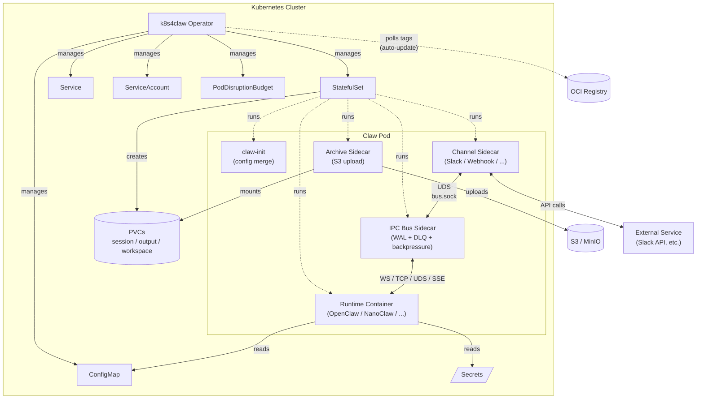

# k8s4claw

[](https://github.com/Prismer-AI/k8s4claw/actions/workflows/ci.yml)
[](https://github.com/Prismer-AI/k8s4claw/actions/workflows/codeql.yml)
[](https://goreportcard.com/report/github.com/Prismer-AI/k8s4claw)
[](LICENSE)

**Kubernetes operator for managing heterogeneous AI agent runtimes.** One CRD, any runtime, production-ready from day one.

k8s4claw lets you deploy, connect, and operate AI agents on Kubernetes the same way you manage any other workload — declaratively, with built-in persistence, auto-updates, and inter-agent communication.

<p align="center">
  <a href="docs/demo.cast">
    
  </a>
  <br/>
  <em>OpenClaw runtime in mock mode — <code>docker run -e OPENCLAW_MODE=mock</code></em>
</p>

## Why k8s4claw?

Running AI agents in production means solving the same problems over and over: secret management, persistent storage, graceful updates, inter-service communication, and observability. k8s4claw wraps all of this into a single `Claw` CRD so you can focus on what your agent does, not how it runs.

## Architecture



### IPC Bus Detail

The **IPC Bus** is a native sidecar that routes JSON messages between channel sidecars and the AI runtime:

```text
Channel Sidecar ──UDS──► IPC Bus ──Bridge──► Runtime Container
                        │  WAL  │
                        │  DLQ  │
                        │ Ring  │
                        │Buffer │
                        └───────┘
```

- **WAL** — append-only write-ahead log for at-least-once delivery
- **DLQ** — BoltDB dead letter queue for messages exceeding retry limits
- **Backpressure** — ring buffer with high/low watermark flow control
- **Bridge protocols** — WebSocket (OpenClaw), TCP (PicoClaw), UDS (NanoClaw), SSE (ZeroClaw)

## Supported Runtimes

| Runtime | Language | Use Case | Gateway | Probe |
|---------|----------|----------|---------|-------|
| **OpenClaw** | TypeScript/Node.js | Full-featured AI assistant platform | 18900 | HTTP |
| **NanoClaw** | TypeScript/Node.js | Lightweight secure personal assistant | 19000 | TCP |
| **ZeroClaw** | Rust | High-performance agent runtime | 3000 | HTTP |
| **PicoClaw** | — | Ultra-minimal serverless agent | 8080 | TCP |
| **IronClaw** | Rust + WASM | Security/privacy-focused AI assistant | 3001 | HTTP |
| **Custom** | Any | Bring your own runtime | — | — |

## Quick Start

### Prerequisites

- Kubernetes cluster (v1.28+, or [kind](https://kind.sigs.k8s.io/) / [minikube](https://minikube.sigs.k8s.io/) for local dev)
- kubectl configured
- Go 1.23+ (for building from source)

### 1. Install CRDs and run the operator

```bash
git clone https://github.com/Prismer-AI/k8s4claw.git
cd k8s4claw

# Install CRDs into the cluster
make install

# Run operator locally (or deploy with `make deploy`)
make run
```

### 2. Create a Secret for your LLM API keys

```bash
kubectl create secret generic llm-api-keys \
  --from-literal=ANTHROPIC_API_KEY=sk-ant-xxx \
  --from-literal=OPENAI_API_KEY=sk-xxx
```

### 3. Deploy your first AI agent

```yaml
# my-agent.yaml
apiVersion: claw.prismer.ai/v1alpha1
kind: Claw
metadata:
  name: my-agent
spec:
  runtime: openclaw
  config:
    model: "claude-sonnet-4"
  credentials:
    secretRef:
      name: llm-api-keys
  persistence:
    session:
      enabled: true
      size: 2Gi
      mountPath: /data/session
    workspace:
      enabled: true
      size: 10Gi
      mountPath: /workspace
```

```bash
kubectl apply -f my-agent.yaml

# Watch it come up
kubectl get claw my-agent -w
```

### 4. Connect a Slack channel (optional)

```yaml
apiVersion: claw.prismer.ai/v1alpha1
kind: ClawChannel
metadata:
  name: slack-team
spec:
  type: slack
  mode: bidirectional
  credentials:
    secretRef:
      name: slack-bot-token
  config:
    appId: "A0123456789"
```

Then reference it in your Claw:

```yaml
spec:
  channels:
    - name: slack-team
      mode: bidirectional
```

## Features

### Declarative Lifecycle Management
- StatefulSet-based with PVC lifecycle, PDB, NetworkPolicy, Ingress
- Per-runtime resource defaults, probes, and graceful shutdown tuning
- Webhook validation: credential requirements, PVC immutability, runtime type lock

### Auto-Update with Circuit Breaker
- OCI registry polling on cron schedule
- Semver constraint filtering (`^1.x`, `~2.0.0`)
- Health-verified rollouts with configurable timeout
- Automatic rollback + circuit breaker after N failures

### Persistence & Archival
- Session, output, and workspace PVCs via StatefulSet volumeClaimTemplates
- CSI VolumeSnapshot on cron schedule with retention pruning
- S3-compatible archival sidecar (S3, MinIO, GCS, R2)

### Go SDK

```go
import "github.com/Prismer-AI/k8s4claw/sdk"

client, err := sdk.NewClient()
if err != nil {
    log.Fatal(err)
}

claw, err := client.Create(ctx, &sdk.ClawSpec{
    Runtime: sdk.OpenClaw,
    Config: &sdk.RuntimeConfig{
        Environment: map[string]string{"MODEL": "claude-sonnet-4"},
    },
})
```

## Development

```bash
make build          # Build operator binary
make build-ipcbus   # Build IPC Bus binary
make test           # Run tests (requires setup-envtest)
make lint           # Lint
make vet            # Run go vet
make fmt            # Run gofmt + goimports
make manifests      # Generate CRD YAML
make generate       # Generate deepcopy
make docker-build   # Build container image
```

See [CONTRIBUTING.md](CONTRIBUTING.md) for the full development guide.

## Design Documents

- [Operator Core Design](docs/plans/2026-03-04-k8s4claw-design.md)
- [IPC Bus + Resilience Design](docs/plans/2026-03-05-phase4-ipcbus-resilience-design.md)
- [Auto-Update Controller Design](docs/plans/2026-03-07-auto-update-design.md)

## License

Apache-2.0
