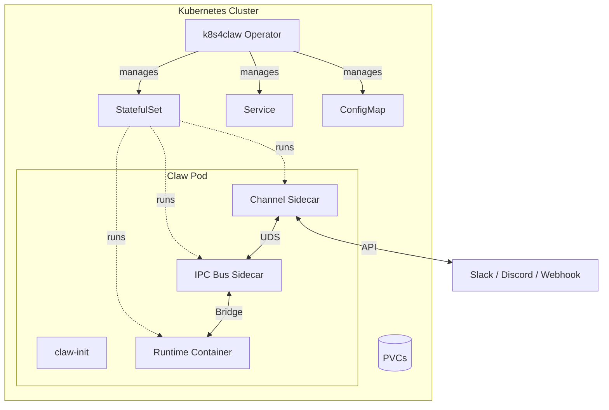

Every AI agent framework has its own deployment story. OpenAI's assistants run one way, Claude-based agents another, open-source frameworks yet another. If you're running multiple agents in production on Kubernetes, you end up writing the same boilerplate over and over: secret management, persistent storage, graceful updates, inter-service communication, observability.

**k8s4claw** wraps all of this into a single Kubernetes operator. One CRD, any runtime, production-ready from day one.

```yaml
apiVersion: claw.prismer.ai/v1alpha1
kind: Claw
metadata:
  name: research-agent
spec:
  runtime: openclaw
  config:
    model: "claude-sonnet-4"
  credentials:
    secretRef:
      name: llm-api-keys
```

That's it. The operator handles StatefulSet creation, PVC lifecycle, credential injection, health probes, network policies, and more.

In this post I'll walk through the architecture, show you how to get started, and explain the design decisions behind the IPC bus, auto-update controller, and runtime adapter system.

---

## The Problem

We were running 5 different AI agent runtimes on Kubernetes:

| Runtime | Language | Use Case |
|---------|----------|----------|
| OpenClaw | TypeScript/Node.js | Full-featured AI assistant |
| NanoClaw | TypeScript/Node.js | Lightweight personal assistant |
| ZeroClaw | Rust | High-performance agent |
| PicoClaw | — | Ultra-minimal serverless |
| IronClaw | Rust + WASM | Security-focused agent |

Each had its own Helm chart, its own sidecar configuration, its own update strategy. Adding a Slack channel to an agent meant editing 4 different files. Rotating credentials meant touching every deployment. Rolling back a bad update was manual and terrifying.

We needed a single control plane.

---

## Architecture



The operator watches `Claw` custom resources and reconciles a full stack of Kubernetes objects: StatefulSet, Service, ConfigMap, ServiceAccount, PDB, NetworkPolicy, and optionally Ingress. Each agent pod contains:

1. **claw-init** — init container that merges runtime config
2. **Runtime container** — the actual AI agent
3. **IPC Bus sidecar** — message routing with WAL-backed delivery
4. **Channel sidecar(s)** — Slack, webhook, or custom integrations

---

## Quick Start

### Prerequisites

- Kubernetes 1.28+ (or [kind](https://kind.sigs.k8s.io/) for local dev)
- Go 1.23+

### Install and run

```bash
git clone https://github.com/Prismer-AI/k8s4claw.git
cd k8s4claw

# Install CRDs
make install

# Run operator locally
make run
```

### Create your first agent

```bash
# Create a secret for your LLM API keys
kubectl create secret generic llm-api-keys \
  --from-literal=ANTHROPIC_API_KEY=sk-ant-xxx

# Deploy an agent
cat <<EOF | kubectl apply -f -
apiVersion: claw.prismer.ai/v1alpha1
kind: Claw
metadata:
  name: my-agent
spec:
  runtime: openclaw
  config:
    model: "claude-sonnet-4"
  credentials:
    secretRef:
      name: llm-api-keys
  persistence:
    session:
      enabled: true
      size: 2Gi
      mountPath: /data/session
    workspace:
      enabled: true
      size: 10Gi
      mountPath: /workspace
EOF

# Watch it come up
kubectl get claw my-agent -w
```

### Connect Slack

```yaml
apiVersion: claw.prismer.ai/v1alpha1
kind: ClawChannel
metadata:
  name: team-slack
spec:
  type: slack
  mode: bidirectional
  credentials:
    secretRef:
      name: slack-bot-token
  config:
    appId: "A0123456789"
```

Reference it in your Claw:

```yaml
spec:
  channels:
    - name: team-slack
      mode: bidirectional
```

The operator automatically injects a Slack sidecar into the pod and wires it through the IPC bus.

---

## Deep Dive: The IPC Bus

The most interesting piece of k8s4claw is the IPC bus. It's a native Kubernetes sidecar (init container with `restartPolicy: Always`) that routes JSON messages between channel sidecars and the AI runtime.

```
Channel Sidecar ──UDS──► IPC Bus ──Bridge──► Runtime Container
                         │ WAL  │
                         │ DLQ  │
                         │ Ring │
                         └──────┘
```

### Why not just HTTP?

We tried. The problem is reliability. When a Slack message comes in and the runtime is temporarily overloaded, you need somewhere to buffer it. When the runtime crashes mid-response, you need to redeliver. When a channel sidecar falls behind, you need backpressure — not dropped messages.

The IPC bus solves this with three mechanisms:

**1. Write-Ahead Log (WAL)** — Every message is appended to a WAL on emptyDir before delivery. If the bus crashes, unacknowledged messages are replayed on recovery. Periodic compaction prevents unbounded growth.

**2. Dead Letter Queue (DLQ)** — Messages that exceed retry limits land in a BoltDB-backed DLQ. They're preserved for debugging, not silently dropped.

**3. Ring Buffer with Backpressure** — A fixed-size ring buffer with configurable high/low watermarks. When the buffer hits the high watermark (default 80%), the bus sends a `slow_down` signal upstream. When it drains to the low watermark (30%), it sends `resume`.

### Bridge Protocols

Different runtimes speak different protocols. The IPC bus abstracts this behind a `RuntimeBridge` interface:

| Runtime | Bridge | Protocol |
|---------|--------|----------|
| OpenClaw | WebSocket | Full-duplex JSON over WS |
| PicoClaw | TCP | Length-prefix framed |
| NanoClaw | UDS | Length-prefix framed |
| ZeroClaw | SSE | HTTP POST + Server-Sent Events |

Adding a new protocol means implementing one interface:

```go
type RuntimeBridge interface {
    Start(ctx context.Context) error
    Send(ctx context.Context, msg Message) error
    Receive(ctx context.Context) (Message, error)
    Close() error
}
```

---

## Deep Dive: Auto-Update Controller

The auto-update controller polls OCI registries on a cron schedule, finds new versions matching a semver constraint, and performs health-verified rollouts with automatic rollback.

```yaml
spec:
  autoUpdate:
    enabled: true
    versionConstraint: "^1.x"
    schedule: "0 3 * * *"       # Check at 3am daily
    healthTimeout: "10m"
    maxRollbacks: 3
```

### How it works

1. **Poll** — On each cron tick, list tags from the OCI registry and filter by semver constraint
2. **Initiate** — Set target-image annotation and enter `HealthCheck` phase
3. **Health check** — Poll StatefulSet readiness every 15 seconds
4. **Success** — All replicas ready → update status, clear annotations, requeue at next cron
5. **Timeout** — Health timeout exceeded → rollback to previous version
6. **Circuit breaker** — After N consecutive rollbacks, stop trying (operator event + Prometheus metric)

The state machine lives entirely in annotations and status conditions, so it survives operator restarts:

```go
phase := claw.Annotations["claw.prismer.ai/update-phase"]
if phase == "HealthCheck" {
    return r.reconcileHealthCheck(ctx, &claw)
}
```

### Version history

Every update attempt is recorded:

```yaml
status:
  autoUpdate:
    currentVersion: "1.2.0"
    versionHistory:
      - version: "1.2.0"
        appliedAt: "2026-03-28T03:00:00Z"
        status: Healthy
      - version: "1.1.5"
        appliedAt: "2026-03-21T03:00:00Z"
        status: RolledBack
    failedVersions: ["1.1.5"]
    circuitOpen: false
```

---

## The Runtime Adapter Pattern

Each runtime is a Go struct implementing `RuntimeAdapter`:

```go
type RuntimeAdapter interface {
    RuntimeBuilder    // PodTemplate, probes, config
    RuntimeValidator  // Validate, ValidateUpdate
}
```

Adding a new runtime takes ~100 lines:

```go
type MyRuntimeAdapter struct{}

func (a *MyRuntimeAdapter) PodTemplate(claw *v1alpha1.Claw) *corev1.PodTemplateSpec {
    return BuildPodTemplate(claw, &RuntimeSpec{
        Image:     "my-registry/my-runtime:latest",
        Ports:     []corev1.ContainerPort{{Name: "gateway", ContainerPort: 8080}},
        Resources: resources("100m", "256Mi", "500m", "512Mi"),
        // ...
    })
}
```

The shared `BuildPodTemplate` handles the common concerns — init containers, volume mounts, security context, environment variables — while each adapter only specifies what's different.

Validation is per-runtime too. OpenClaw and IronClaw require credentials (they talk to LLM APIs). ZeroClaw and PicoClaw don't. All runtimes share persistence update validation (storage class immutable, PVC size expansion-only).

---

## Go SDK

For programmatic access, there's a Go SDK:

```go
import "github.com/Prismer-AI/k8s4claw/sdk"

client, err := sdk.NewClient()

// Create an agent
claw, err := client.Create(ctx, &sdk.ClawSpec{
    Runtime: sdk.OpenClaw,
    Config: &sdk.RuntimeConfig{
        Environment: map[string]string{"MODEL": "claude-sonnet-4"},
    },
})

// Watch for readiness
err = client.WaitForReady(ctx, claw.Name, 5*time.Minute)
```

There's also a channel SDK for building custom sidecars:

```go
import "github.com/Prismer-AI/k8s4claw/sdk/channel"

client, err := channel.NewClient(
    channel.WithSocketPath("/var/run/claw/bus.sock"),
    channel.WithBufferSize(100),
)

// Send a message to the runtime
err = client.Send(ctx, channel.Message{
    Type:    "user_message",
    Payload: json.RawMessage(`{"text": "Hello"}`),
})

// Receive runtime responses
msg, err := client.Receive(ctx)
```

---

## Testing Strategy

We aimed for 80%+ coverage across all packages, and achieved it:

| Package | Coverage |
|---------|----------|
| internal/webhook | 97.6% |
| internal/runtime | 94.0% |
| internal/registry | 85.7% |
| sdk | 83.1% |
| internal/controller | 81.6% |
| sdk/channel | 81.5% |
| internal/ipcbus | 80.8% |

The testing pyramid:

- **Unit tests** — pure functions, table-driven, `t.Parallel()` everywhere
- **Fake client tests** — `fake.NewClientBuilder()` for controller logic without a real cluster
- **envtest integration tests** — real etcd + API server for webhook validation and reconcile loops

For the auto-update controller, we used dependency injection with `Clock` and `TagLister` interfaces to make time-dependent and registry-dependent code fully testable without network calls.

---

## What's Next

k8s4claw is open source under Apache-2.0. We're looking for contributors! Here are some good starting points:

- [Add credential validation to ZeroClaw/PicoClaw](https://github.com/Prismer-AI/k8s4claw/issues/1) — Easy, single file
- [Add Helm chart](https://github.com/Prismer-AI/k8s4claw/issues/2) — Medium
- [Add Discord channel sidecar](https://github.com/Prismer-AI/k8s4claw/issues/3) — Medium
- [Boost test coverage to 85%+](https://github.com/Prismer-AI/k8s4claw/issues/4) — Medium
- [Add local dev setup guide](https://github.com/Prismer-AI/k8s4claw/issues/5) — Easy

**GitHub**: [github.com/Prismer-AI/k8s4claw](https://github.com/Prismer-AI/k8s4claw)

If you're running AI agents on Kubernetes and tired of managing the infrastructure around them, give k8s4claw a try. Star the repo if it's useful, and open an issue if it isn't — we want to hear both.
