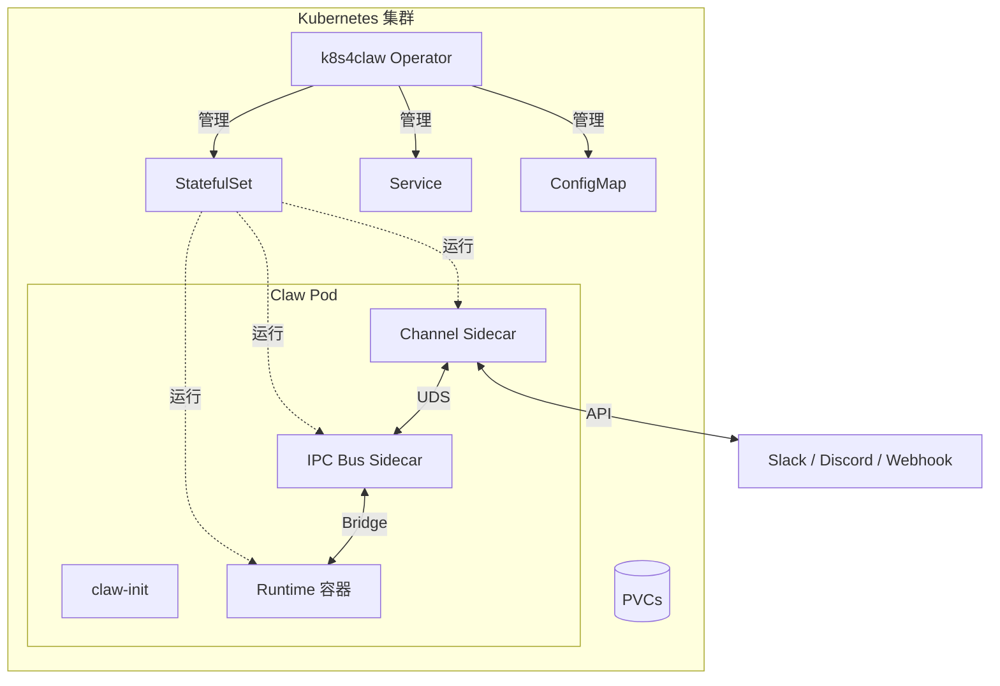

每个 AI Agent 框架都有自己的部署方案。OpenAI 的 Assistants 一套、Claude Agent 一套、开源框架又是另一套。如果你在 Kubernetes 上跑多个 Agent，最终都会重复写同样的东西：Secret 管理、持久化存储、优雅更新、服务间通信、可观测性。

**k8s4claw** 把这一切封装成一个 Kubernetes Operator。一个 CRD，任意 runtime，开箱即用。

```yaml
apiVersion: claw.prismer.ai/v1alpha1
kind: Claw
metadata:
  name: research-agent
spec:
  runtime: openclaw
  config:
    model: "claude-sonnet-4"
  credentials:
    secretRef:
      name: llm-api-keys
```

就这么简单。Operator 会自动处理 StatefulSet 创建、PVC 生命周期、凭证注入、健康探针、网络策略等一切。

本文将介绍整体架构、快速上手流程，以及 IPC 总线、自动更新控制器、Runtime Adapter 系统的设计决策。

---

## 我们遇到的问题

团队里跑着 5 个不同的 AI Agent runtime：

| Runtime | 语言 | 用途 |
|---------|------|------|
| OpenClaw | TypeScript/Node.js | 全功能 AI 助手平台 |
| NanoClaw | TypeScript/Node.js | 轻量级个人助手 |
| ZeroClaw | Rust | 高性能 Agent 运行时 |
| PicoClaw | — | 极简 Serverless Agent |
| IronClaw | Rust + WASM | 安全/隐私优先的 AI 助手 |

每个都有自己的 Helm chart、自己的 sidecar 配置、自己的更新策略。给某个 Agent 加个 Slack 通道需要改 4 个文件。轮换凭证需要逐个部署修改。回滚一个坏版本全靠手动操作。

我们需要一个统一的控制面。

---

## 架构



Operator 监听 `Claw` 自定义资源，将其调谐为一整套 Kubernetes 对象：StatefulSet、Service、ConfigMap、ServiceAccount、PDB、NetworkPolicy、以及可选的 Ingress。每个 Agent Pod 包含：

1. **claw-init** — Init 容器，负责合并运行时配置
2. **Runtime 容器** — 实际的 AI Agent
3. **IPC Bus sidecar** — 消息路由，带 WAL 持久化投递保证
4. **Channel sidecar** — Slack、Discord、Webhook 等集成

---

## 快速上手

### 方式一：Docker 体验（无需 K8s）

```bash
# Mock 模式，不需要 API Key
docker run --rm -p 18900:18900 -e OPENCLAW_MODE=mock \
  ghcr.io/prismer-ai/k8s4claw-openclaw:0.1.0

# 另一个终端
python3 scripts/ws-demo.py
→ You: Hello!
← Agent: Hello! I'm an OpenClaw agent running on Kubernetes...
```

### 方式二：Kind 集群（完整 K8s 体验）

```bash
git clone https://github.com/Prismer-AI/k8s4claw.git
cd k8s4claw

# 创建集群 + 构建镜像
kind create cluster --name k8s4claw
docker build -t k8s4claw-openclaw:dev -f runtimes/openclaw/Dockerfile runtimes/openclaw/
kind load docker-image k8s4claw-openclaw:dev --name k8s4claw

# 安装 CRDs + 启动 operator
make install
bin/operator --disable-webhooks &

# 部署 Agent
kubectl create secret generic llm-api-keys --from-literal=ANTHROPIC_API_KEY=mock-key
cat <<EOF | kubectl apply -f -
apiVersion: claw.prismer.ai/v1alpha1
kind: Claw
metadata:
  name: my-agent
spec:
  runtime: openclaw
  credentials:
    secretRef:
      name: llm-api-keys
EOF

kubectl get claws
# NAME       RUNTIME    PHASE          AGE
# my-agent   openclaw   Provisioning   5s
```

### 方式三：GitHub Codespaces（一键体验）

点击下面的按钮，3 分钟内即可在浏览器中体验完整的 K8s 环境：

[](https://codespaces.new/Prismer-AI/k8s4claw?quickstart=1)

---

## 深入：IPC 消息总线

k8s4claw 最有意思的部分是 IPC 总线。它是一个 Kubernetes 原生 Sidecar（`restartPolicy: Always` 的 init 容器），负责在 Channel Sidecar 和 AI Runtime 之间路由 JSON 消息。

```
Channel Sidecar ──UDS──► IPC Bus ──Bridge──► Runtime 容器
                         │ WAL  │
                         │ DLQ  │
                         │ Ring │
                         └──────┘
```

### 为什么不直接用 HTTP？

我们试过。问题在于可靠性。当 Slack 消息到达但 Runtime 暂时过载时，你需要缓冲区。当 Runtime 在响应过程中崩溃时，你需要重新投递。当某个 Channel Sidecar 落后时，你需要背压机制 —— 而不是丢消息。

IPC 总线通过三个机制解决这些问题：

**1. Write-Ahead Log (WAL)** — 每条消息在投递前先追加写入 emptyDir 上的 WAL。如果总线崩溃，未确认的消息在恢复时自动重放。定期压缩防止无限增长。

**2. Dead Letter Queue (DLQ)** — 超过重试上限的消息落入 BoltDB 支撑的死信队列。保留用于调试，而不是静默丢弃。

**3. 环形缓冲 + 背压** — 固定大小的环形缓冲，支持高低水位线配置。当缓冲区使用率达到高水位（默认 80%）时，总线向上游发送 `slow_down` 信号；当回落到低水位（30%）时，发送 `resume`。

### 桥接协议

不同的 Runtime 使用不同的通信协议。IPC 总线通过 `RuntimeBridge` 接口屏蔽差异：

| Runtime | 桥接 | 协议 |
|---------|------|------|
| OpenClaw | WebSocket | 全双工 JSON over WS |
| PicoClaw | TCP | 长度前缀帧 |
| NanoClaw | UDS | 长度前缀帧 |
| ZeroClaw | SSE | HTTP POST + Server-Sent Events |

新增一种协议只需实现一个接口：

```go
type RuntimeBridge interface {
    Connect(ctx context.Context) error
    Send(ctx context.Context, msg *Message) error
    Receive(ctx context.Context) (<-chan *Message, error)
    Close() error
}
```

---

## 深入：自动更新控制器

自动更新控制器按 cron 调度轮询 OCI 镜像仓库，查找符合 semver 约束的新版本，执行健康验证的滚动更新，并在失败时自动回滚。

```yaml
spec:
  autoUpdate:
    enabled: true
    versionConstraint: "^1.x"
    schedule: "0 3 * * *"       # 每天凌晨 3 点检查
    healthTimeout: "10m"
    maxRollbacks: 3
```

### 工作流程

1. **轮询** — 每个 cron 周期，列出 OCI 仓库的 tags 并按 semver 过滤
2. **发起更新** — 设置目标镜像注解，进入 `HealthCheck` 阶段
3. **健康检查** — 每 15 秒检查 StatefulSet 就绪状态
4. **成功** — 所有副本就绪 → 更新状态，清理注解，按下次 cron 重新入队
5. **超时** — 健康检查超时 → 回滚到上一版本
6. **熔断器** — 连续 N 次回滚后停止尝试（发送 Kubernetes Event + Prometheus 指标）

状态机完全基于注解和 status conditions 实现，Operator 重启后可恢复：

```go
phase := claw.Annotations["claw.prismer.ai/update-phase"]
if phase == "HealthCheck" {
    return r.reconcileHealthCheck(ctx, &claw)
}
```

---

## Runtime Adapter 模式

每个 Runtime 是一个实现 `RuntimeAdapter` 接口的 Go 结构体：

```go
type RuntimeAdapter interface {
    RuntimeBuilder    // PodTemplate, 探针, 配置
    RuntimeValidator  // Validate, ValidateUpdate
}
```

新增一个 Runtime 只需约 100 行代码：

```go
type MyRuntimeAdapter struct{}

func (a *MyRuntimeAdapter) PodTemplate(claw *v1alpha1.Claw) *corev1.PodTemplateSpec {
    return BuildPodTemplate(claw, &RuntimeSpec{
        Image:     "my-registry/my-runtime:latest",
        Ports:     []corev1.ContainerPort{{Name: "gateway", ContainerPort: 8080}},
        Resources: resources("100m", "256Mi", "500m", "512Mi"),
    })
}
```

共享的 `BuildPodTemplate` 处理公共关注点（init 容器、卷挂载、安全上下文、环境变量），每个 Adapter 只需指定差异化部分。

校验也是按 Runtime 定制的。OpenClaw 和 IronClaw 要求必须配置凭证（它们需要调用 LLM API），ZeroClaw 和 PicoClaw 不要求。所有 Runtime 共享持久化更新校验（存储类不可变、PVC 只能扩容不能缩容）。

---

## Go SDK

提供 Go SDK 用于程序化访问：

```go
import "github.com/Prismer-AI/k8s4claw/sdk"

client, err := sdk.NewClient()

// 创建一个 Agent
claw, err := client.Create(ctx, &sdk.ClawSpec{
    Runtime: sdk.OpenClaw,
    Config: &sdk.RuntimeConfig{
        Environment: map[string]string{"MODEL": "claude-sonnet-4"},
    },
})

// 等待就绪
err = client.WaitForReady(ctx, claw.Name, 5*time.Minute)
```

还有 Channel SDK 用于开发自定义 Sidecar：

```go
import "github.com/Prismer-AI/k8s4claw/sdk/channel"

client, err := channel.NewClient(
    channel.WithSocketPath("/var/run/claw/bus.sock"),
    channel.WithBufferSize(100),
)

// 向 Runtime 发送消息
err = client.Send(ctx, channel.Message{
    Type:    "user_message",
    Payload: json.RawMessage(`{"text": "Hello"}`),
})

// 接收 Runtime 回复
msg, err := client.Receive(ctx)
```

---

## 测试策略

目标是所有包 80%+ 覆盖率，已达成：

| 包 | 覆盖率 |
|---|--------|
| internal/webhook | 97.6% |
| internal/runtime | 94.0% |
| internal/registry | 86.0% |
| sdk | 83.1% |
| cmd/channel-webhook | 81.8% |
| internal/controller | 81.6% |
| sdk/channel | 81.5% |
| internal/ipcbus | 80.9% |
| cmd/channel-slack | 80.7% |
| cmd/channel-discord | 80.1% |

测试金字塔：

- **单元测试** — 纯函数，表驱动，`t.Parallel()` 全覆盖
- **Fake client 测试** — `fake.NewClientBuilder()` 测试 controller 逻辑，不需要真集群
- **envtest 集成测试** — 真实 etcd + API server，测试 webhook 校验和 reconcile 流程

自动更新控制器通过依赖注入 `Clock` 和 `TagLister` 接口，使时间相关和仓库相关的代码完全可测试，无需网络调用。

---

## 容器镜像

所有镜像已发布到 GitHub Container Registry，公开可拉取：

```bash
docker pull ghcr.io/prismer-ai/k8s4claw:0.1.0            # Operator
docker pull ghcr.io/prismer-ai/k8s4claw-openclaw:0.1.0    # OpenClaw Runtime
docker pull ghcr.io/prismer-ai/claw-ipcbus:0.1.0          # IPC Bus
docker pull ghcr.io/prismer-ai/claw-channel-slack:0.1.0   # Slack Sidecar
docker pull ghcr.io/prismer-ai/claw-channel-discord:0.1.0 # Discord Sidecar
docker pull ghcr.io/prismer-ai/claw-channel-webhook:0.1.0 # Webhook Sidecar
docker pull ghcr.io/prismer-ai/claw-init:0.1.0            # Init Container
```

---

## 下一步

k8s4claw 基于 Apache-2.0 开源。欢迎贡献！

- [Hermes Agent runtime adapter](https://github.com/Prismer-AI/k8s4claw/issues/10) — 集成 40k star 的 AI Agent 框架
- [Snapshot/PDB envtest 测试](https://github.com/Prismer-AI/k8s4claw/issues/4) — Good First Issue

**GitHub**: [github.com/Prismer-AI/k8s4claw](https://github.com/Prismer-AI/k8s4claw)

**Demo 视频 (80s)**：[下载](https://github.com/Prismer-AI/k8s4claw/releases/download/v0.1.0/demo-k8s.mp4)

如果你在 Kubernetes 上跑 AI Agent，又厌倦了重复造轮子 —— 试试 k8s4claw。觉得有用就给个 star，觉得不好用就提 issue —— 两种反馈我们都欢迎。
